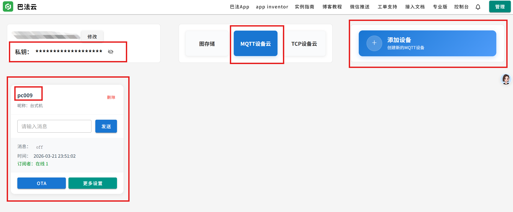
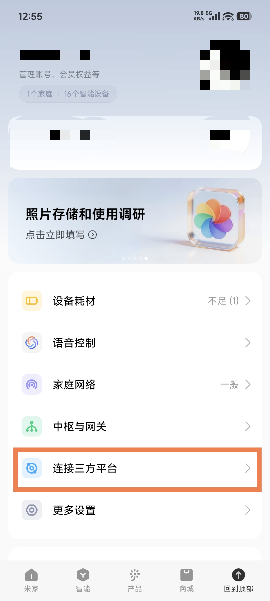
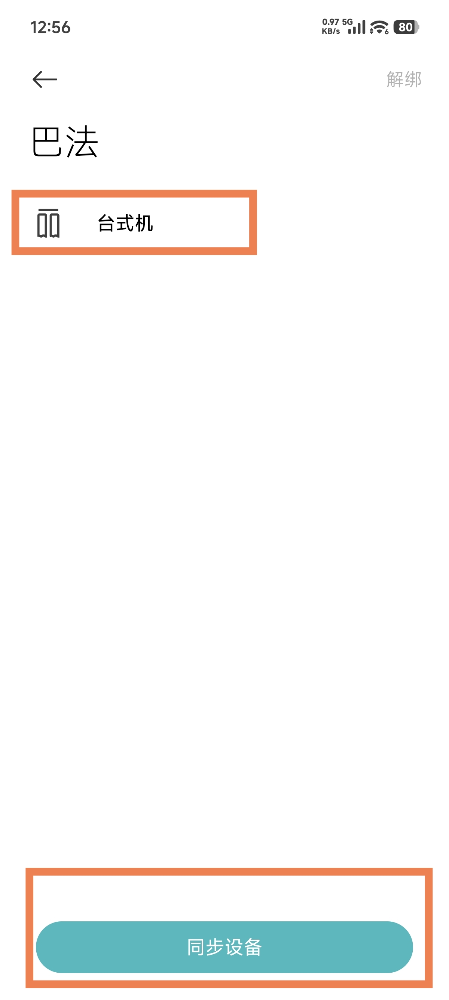
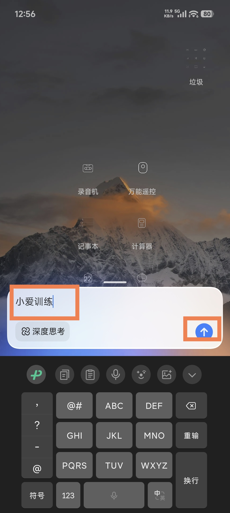
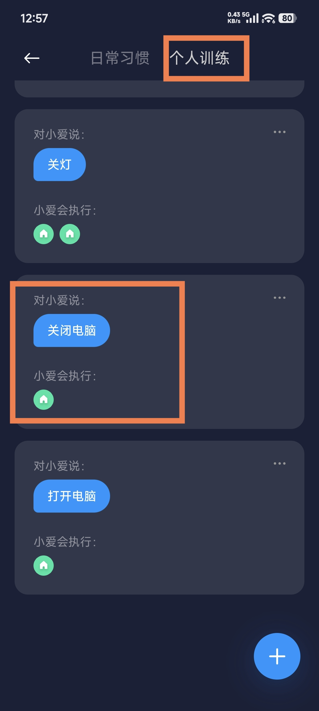
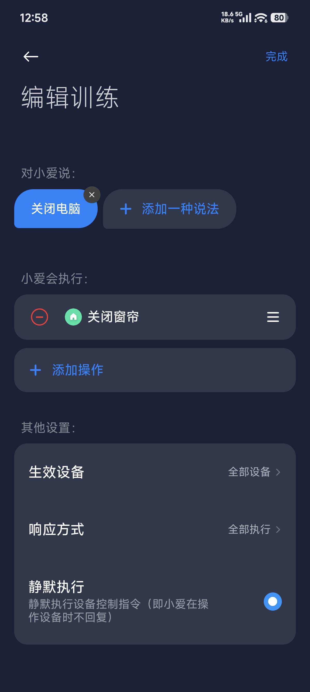
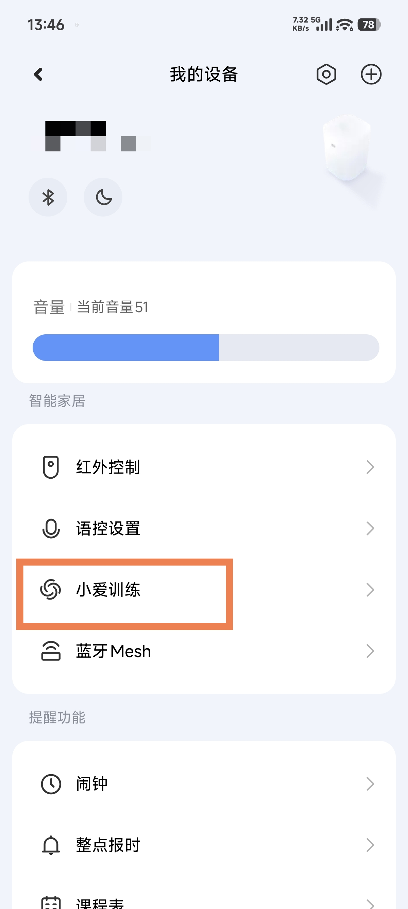

# xiaoai-control-pc

用小爱同学控制电脑关机，以及扩展更多自定义操作。

## 实现方式

### 关机 / 其他操作

`小爱同学（小米音箱或小米手机） -> 小爱训练 -> 米家中的巴法云设备 -> 巴法云 MQTT -> 本地程序（可注册为 Windows 服务） -> 执行电脑操作`

### 开机

`小爱同学（小米音箱或小米手机） -> 小爱训练 -> 打开小米智能插座 -> 电脑通电 -> 主板来电自启`

## 使用前准备

你需要准备：

1. 巴法云账号
2. 米家 App
3. 小米音箱 App 或小米手机
4. 一台 Windows 电脑
5. 如果要做开机，再准备一个小米智能插座

## 配置流程

### 1. 在巴法云创建设备

推荐直接使用窗帘设备，因为当前项目默认开放的就是这几个 key：

- `off`
- `on`
- `pause`

对应关系如下：

- `off` -> 关机
- `on` -> 重启
- `pause` -> 注销当前用户

如果你后面还想用 `on#10`、`on#20` 这类更多 key，需要自己拉代码并修改 `src/config/action-map.js`。

创建完成后，记下：

- 巴法云私钥
- Topic



### 2. 在米家绑定巴法云

<table>
  <tr>
    <td></td>
    <td></td>
  </tr>
  <tr>
    <td>打开米家 App，进入“我的”页面</td>
    <td>进入“连接第三方平台”，搜索并绑定巴法云，完成后同步刚创建的 MQTT 设备</td>
  </tr>
</table>

### 3. 在小爱同学中配置训练指令

进入“小爱训练”有两种方式。

小米手机进入：

<table>
  <tr>
    <td></td>
    <td></td>
    <td></td>
  </tr>
  <tr>
    <td>打开小爱同学，进入“小爱训练”</td>
    <td>进入“个人训练”，例如添加“关闭电脑”“重启电脑”“注销当前用户”这类语音指令</td>
    <td>添加语音指令，并选择刚才同步到米家的巴法云设备，例如：关闭电脑 -> `off`，重启电脑 -> `on`，注销当前用户 -> `pause`</td>
  </tr>
</table>

小米音箱 App 进入：

<table>
  <tr>
    <td></td>
    <td></td>
  </tr>
  <tr>
    <td>首页进入“全部功能”</td>
    <td>在“我的设备”中进入“小爱训练”</td>
  </tr>
</table>

## 开机说明

如果要实现“打开电脑”，可以把电脑电源接到小米智能插座上，并在主板 BIOS 中开启来电自启。

然后在小爱训练里，把“打开电脑”这条指令绑定为打开插座即可。

<table>
  <tr>
    <td></td>
  </tr>
  <tr>
    <td>小米智能插座示例</td>
  </tr>
</table>

## 本地程序使用

### 1. 安装依赖

```bash
npm install
```

### 2. 配置环境变量

复制模板文件：

```bash
copy .env.example .env
```

填写这两个配置：

```env
BEMFA_UID=你的巴法云私钥
BEMFA_TOPIC=你的Topic
```

### 3. 本地运行

```bash
npm start
```

### 4. 安装为 Windows 服务

如果你希望电脑开机后自动常驻运行，可以安装为 Windows 服务：

```bash
npm run install-service
```

查看服务状态：

```bash
npm run service-status
```

卸载服务：

```bash
npm run uninstall-service
```

说明：

- 安装成 Windows 服务后，不要删除当前项目目录，因为服务仍然依赖当前目录中的脚本、依赖和配置文件
- 不要修改当前项目目录路径，因为服务注册时使用的是当前目录下的实际文件路径
- 不要删除 `node_modules`，因为服务运行时仍然需要这些依赖
- `.env` 需要保留，因为服务启动时仍然要读取其中的配置

## 默认动作和自定义位置

当前默认开放这几个动作：

- `off` -> 关机
- `on` -> 重启
- `pause` -> 注销当前用户

自定义操作时，你只需要改这一个文件：

- `src/config/action-map.js`

文件里现在是这种写法：

```js
const actionMap = {};

actionMap.off = {
  description: "关机",
  command: "shutdown /s /t 0",
};

actionMap.on = {
  description: "重启",
  command: "shutdown /r /t 0",
};

actionMap.pause = {
  description: "注销当前用户",
  command: "shutdown /l",
};
```

你只需要看两项：

- `description`：这个动作是干什么的
- `command`：电脑实际执行的命令

如果后面你想加更多指令，就直接改 `src/config/action-map.js`。默认没有开放的 key，需要自己拉代码后修改。
